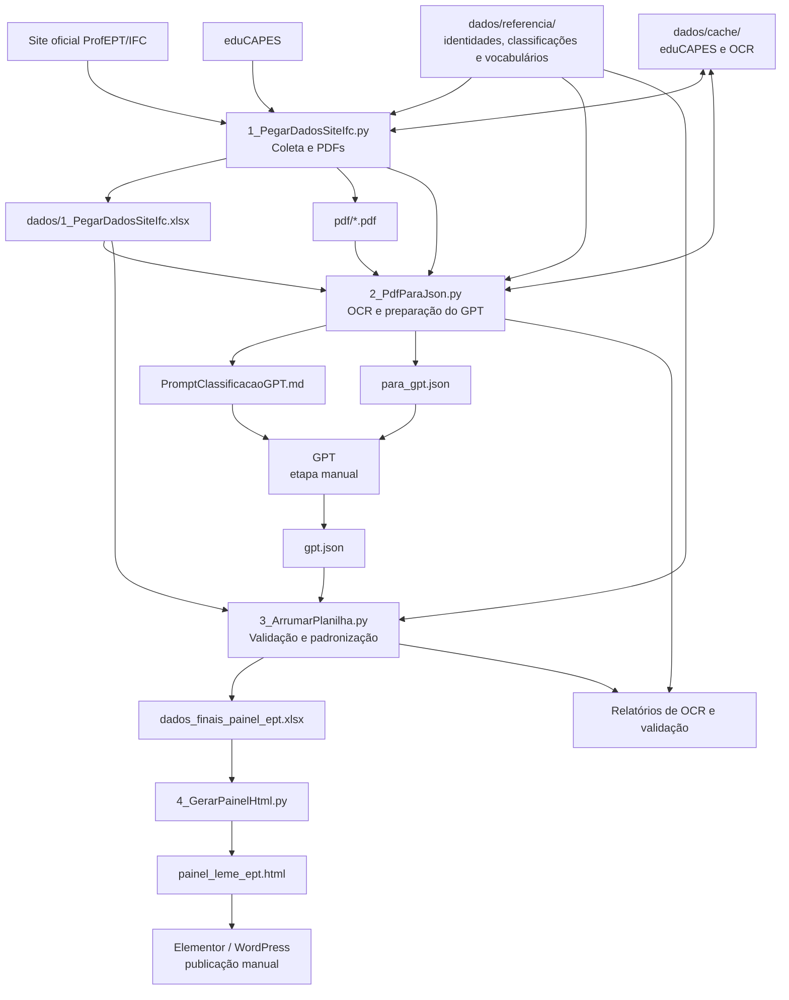
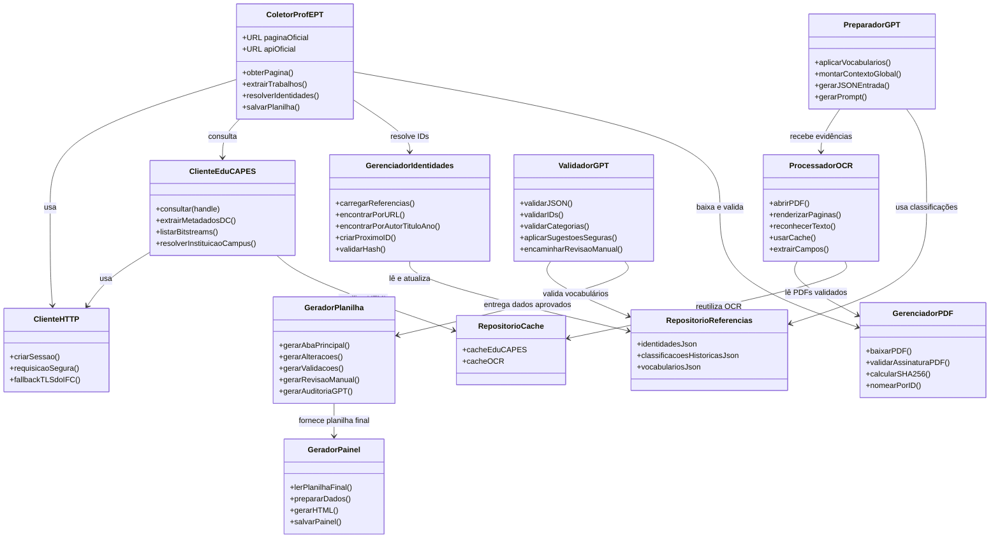
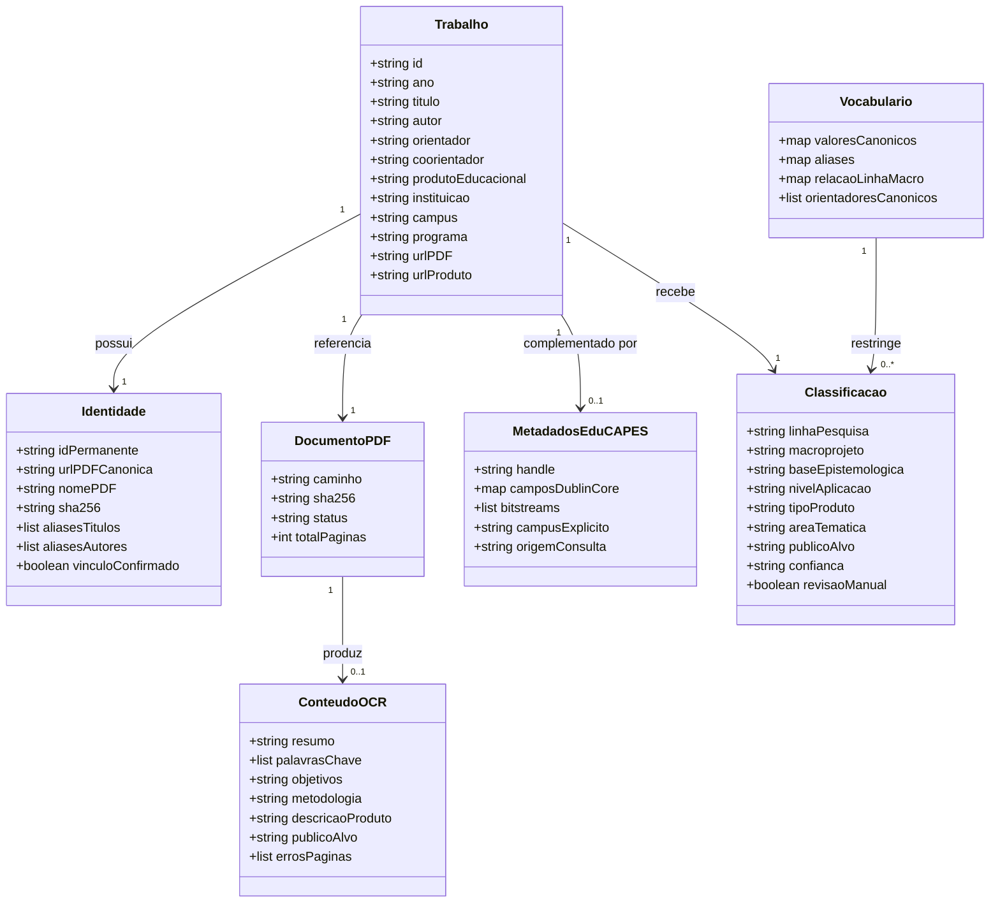
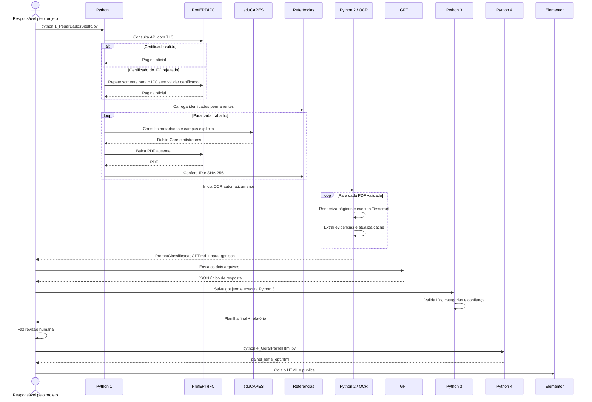
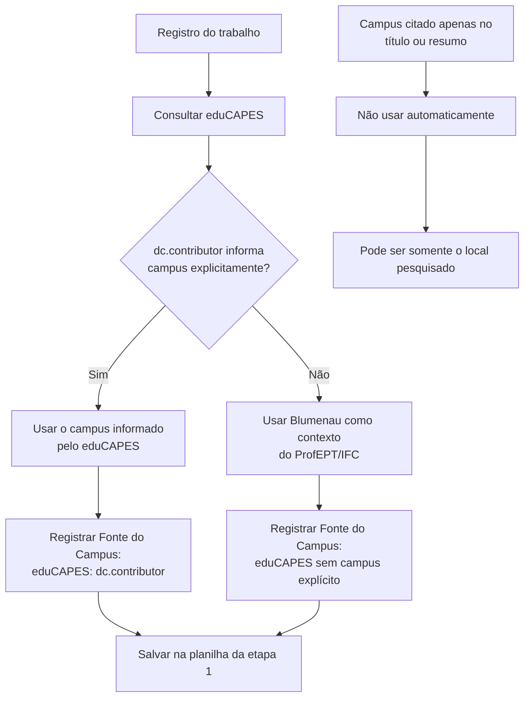
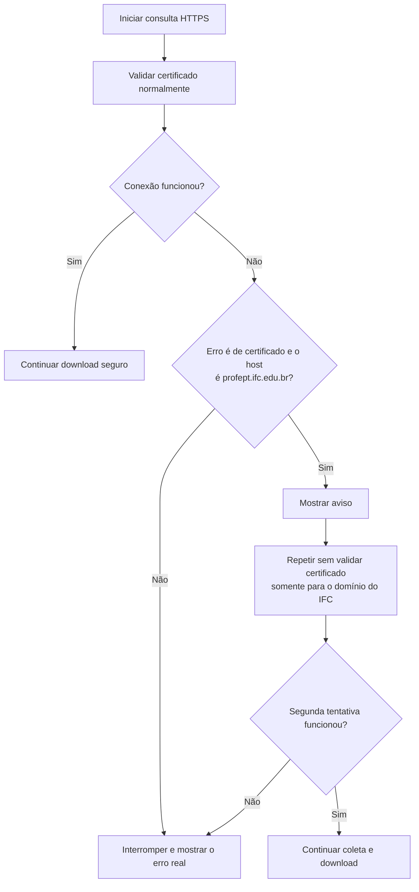
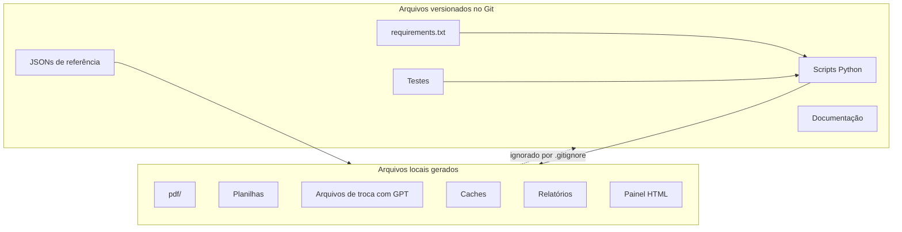
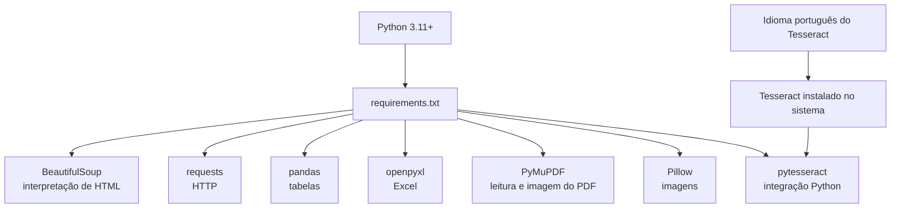

# Diagramas do PAINEL EPT / LEME

Este documento complementa o guia de continuidade com uma visão visual do sistema.

O código atual é procedural: ele está organizado em scripts e funções, não em classes Python. Por isso, o diagrama de classes abaixo é conceitual. Ele representa as responsabilidades do sistema e ajuda a entender como uma futura reorganização em classes poderia ser feita.

## 1. Visão geral do fluxo

## 2. Diagrama de classes conceitual

## 3. Modelo conceitual dos dados

## 4. Diagrama de sequência da execução normal

## 5. Decisão da instituição e do campus

## 6. Decisão de conexão TLS e download

## 7. Ciclo de vida dos arquivos

## 8. Dependências técnicas

O `requirements.txt` instala as bibliotecas Python. O Tesseract e seu pacote de idioma são dependências externas e precisam ser instalados no sistema operacional.
